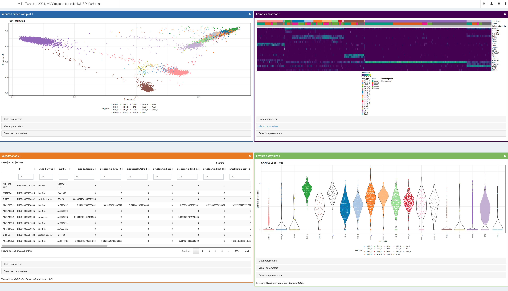
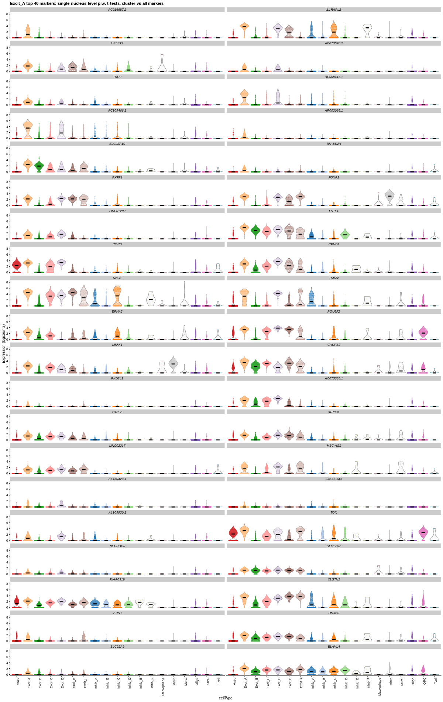

[](https://zenodo.org/badge/latestdoi/248090643)

# 10xPilot_snRNAseq-human


## Study design

This project, led by [Matthew N. Tran](https://twitter.com/mattntran) and [Kristen R. Maynard](https://twitter.com/kr_maynard), describes a single nuclei RNA sequencing (snRNA-seq) project with data extracted from eight postmortem human brain donors collected by the [Lieber Institute for Brain Development](https://twitter.com/LieberInstitute). Tran, Maynard and colleagues generated snRNA-seq data from five different brain regions:

1. amygdala (AMY)
1. dorsolateral prefrontal cortex (DLPFC)
1. hippocampus (HPC)
1. nucleus accumbens (NAc)
1. subgenual anterior cingulate cortex (sACC)

The research findings derived from this dataset are described in the [publications listed below](https://github.com/LieberInstitute/10xPilot_snRNAseq-human#how-to-cite). This data is also publicly available and is intended to serve as a resource for furthering our understanding of the transcriptional activity in the human brain. For example, the data from this study has been used by LIBD researchers for performing deconvolution of bulk RNA sequencing data. This resource is composed of **70,615 high-quality nuclei** and you can download both the [raw data as well as the processed data](https://github.com/LieberInstitute/10xPilot_snRNAseq-human#work-with-the-data). Furthermore, you can [explore interactively the data](https://github.com/LieberInstitute/10xPilot_snRNAseq-human#explore-the-data-interactively) on your browser, make your custom visualizations, and export them to PDF files.

Finally, we have two versions of this resource. The initial version was shared on 2020 as a pre-print publication, while the peer-reviewed version was published in 2021. The pre-print version is limited as it contains data from three donors, while the peer-reviewed version was expanded to eight donors.

## How to cite

### Peer-reviewed

Matthew N. Tran, Kristen R. Maynard, Abby Spangler, Louise A. Huuki, Kelsey D. Montgomery, Vijay Sadashivaiah, Madhavi Tippani, Brianna K. Barry, Dana B. Hancock, Stephanie C. Hicks, Joel E. Kleinman, Thomas M. Hyde, Leonardo Collado-Torres, Andrew E. Jaffe, Keri Martinowich. Single-nucleus transcriptome analysis reveals cell-type-specific molecular signatures across reward circuitry in the human brain. _Neuron_ 109, 3088-3103.E5. https://doi.org/10.1016/j.neuron.2021.09.001

Here's the citation information on [BibTeX](https://en.wikipedia.org/wiki/BibTeX) format.

```
@article {Tran2021,
	author = {Matthew N. Tran and Kristen R. Maynard and Abby Spangler and Louise A. Huuki and Kelsey D. Montgomery and Vijay Sadashivaiah and Madhavi Tippani and Brianna K. Barry and Dana B. Hancock and Stephanie C. Hicks and Joel E. Kleinman and Thomas M. Hyde and Leonardo Collado-Torres and Andrew E. Jaffe and Keri Martinowich},
	title = {Single-nucleus transcriptome analysis reveals cell-type-specific molecular signatures across reward circuitry in the human brain},
	url = {https://doi.org/10.1016/j.neuron.2021.09.001},
	year = {2021},
	doi = {10.1016/j.neuron.2021.09.001},
	publisher = {Elsevier {BV}},
	volume = {109},
	number = {19},
	pages = {3088--3103.e5},
	journal = {Neuron}
}
```

### Pre-print

Matthew N. Tran, Kristen R. Maynard, Abby Spangler, Leonardo Collado-Torres, Vijay Sadashivaiah, Madhavi Tippani, Brianna K. Barry, Dana B. Hancock, Stephanie C. Hicks, Joel E. Kleinman, Thomas M. Hyde, Keri Martinowich, Andrew E. Jaffe. Single-nucleus transcriptome analysis reveals cell type-specific molecular signatures across reward circuitry in the human brain. _bioRxiv_ 2020.10.07.329839; doi: https://doi.org/10.1101/2020.10.07.329839.

Here's the citation information on [BibTeX](https://en.wikipedia.org/wiki/BibTeX) format.

```
@article {Tran2020.10.07.329839,
	author = {Tran, Matthew N. and Maynard, Kristen R. and Spangler, Abby and Collado-Torres, Leonardo and Sadashivaiah, Vijay and Tippani, Madhavi and Barry, Brianna K. and Hancock, Dana B. and Hicks, Stephanie C. and Kleinman, Joel E. and Hyde, Thomas M. and Martinowich, Keri and Jaffe, Andrew E.},
	title = {Single-nucleus transcriptome analysis reveals cell type-specific molecular signatures across reward circuitry in the human brain},
	elocation-id = {2020.10.07.329839},
	year = {2020},
	doi = {10.1101/2020.10.07.329839},
	publisher = {Cold Spring Harbor Laboratory},
	URL = {https://www.biorxiv.org/content/early/2020/10/08/2020.10.07.329839},
	eprint = {https://www.biorxiv.org/content/early/2020/10/08/2020.10.07.329839.full.pdf},
	journal = {bioRxiv}
}

```


## Explore the data interactively

We have provided 5 interactive websites that allow you to explore the data at single nucleus resolution for each of the brain regions. These interactive websites are powered by [`iSEE`](https://bioconductor.org/packages/iSEE) that allows you to add, hide, customize panels for visualizing the data. You can create any custom visualizations that you want and download both the code to make them as well as the figures you make. Please check the [`iSEE`](https://bioconductor.org/packages/iSEE) documentation for instructions on how to customize the panels. In particular, you might be interested in visualizing some of the marker genes from the lists provided below for the _region-specific analyses_.

* AMY: https://libd.shinyapps.io/tran2021_AMY/
* DLPFC: https://libd.shinyapps.io/tran2021_DLPFC/
* HPC: https://libd.shinyapps.io/tran2021_HPC/
* NAc: https://libd.shinyapps.io/tran2021_NAc/
* sACC: https://libd.shinyapps.io/tran2021_sACC/

<a href="https://libd.shinyapps.io/tran2021_AMY/"></a>

If you want to make these websites on your own computer, check the [`shiny_apps`](shiny_apps/) directory.

### Pre-print version

If you are interested in exploring the data from the pre-print version which had three donors instead of eight, please check the following links.

* AMY: https://libd.shinyapps.io/tran2020_Amyg/
* DLPFC: https://libd.shinyapps.io/tran2020_DLPFC/
* HPC: https://libd.shinyapps.io/tran2020_HPC/
* NAc: https://libd.shinyapps.io/tran2020_NAc/
* sACC: https://libd.shinyapps.io/tran2020_sACC/


## Work with the data

### Raw data

If you are interested in the raw data, that is the [FASTQ](https://en.wikipedia.org/wiki/FASTQ_format) files, they are publicly available from the Globus endpoint `jhpce#tran2021` that is also listed at http://research.libd.org/globus/.

### Processed data

The corresponding [`SingleCellExperiment`](http://bioconductor.org/packages/SingleCellExperiment/) [R](https://cran.r-project.org/)/[Bioconductor](http://bioconductor.org/) objects (with `reducedDims`, annotations, etc.) for each of the five regions across eight donors are publicly hosted at:

* [AMY](https://libd-snrnaseq-pilot.s3.us-east-2.amazonaws.com/SCE_AMY-n5_tran-etal.rda)
* [DLPFC](https://libd-snrnaseq-pilot.s3.us-east-2.amazonaws.com/SCE_DLPFC-n3_tran-etal.rda)
* [HPC](https://libd-snrnaseq-pilot.s3.us-east-2.amazonaws.com/SCE_HPC-n3_tran-etal.rda)
* [NAc](https://libd-snrnaseq-pilot.s3.us-east-2.amazonaws.com/SCE_NAc-n8_tran-etal.rda)
* [sACC](https://libd-snrnaseq-pilot.s3.us-east-2.amazonaws.com/SCE_sACC-n5_tran-etal.rda)

### Pre-print version

These files match the pre-print version that was composed of data derived from three donors.

* [AMY](https://libd-snrnaseq-pilot.s3.us-east-2.amazonaws.com/SCE_AMY_tran-etal.rda)
* [DLPFC](https://libd-snrnaseq-pilot.s3.us-east-2.amazonaws.com/SCE_DLPFC_tran-etal.rda)
* [HPC](https://libd-snrnaseq-pilot.s3.us-east-2.amazonaws.com/SCE_HPC_tran-etal.rda)
* [NAc](https://libd-snrnaseq-pilot.s3.us-east-2.amazonaws.com/SCE_NAc_tran-etal.rda)
* [sACC](https://libd-snrnaseq-pilot.s3.us-east-2.amazonaws.com/SCE_sACC_tran-etal.rda)

### R/Bioconductor background

<a href="https://bioconductor.org/books/release/OSCA/data-infrastructure.html"></a>

If you are new to R/Bioconductor as well `SingleCellExperiment` objects, you might be interested in the:

* [Orchestrating Single Cell Analysis (OSCA) with Bioconductor](https://bioconductor.org/books/release/OSCA/) book
* 2020 [WEHI scRNA-seq course](https://drive.google.com/drive/folders/1cn5d-Ey7-kkMiex8-74qxvxtCQT6o72h) taught by [Peter Hickey](https://twitter.com/PeteHaitch) with material adapted from OSCA
* following [LIBD rstats club](https://docs.google.com/spreadsheets/d/1is8dZSd0FZ9Qi1Zvq1uRhm-P1McnJRd_zxdAfCRoMfA/edit?usp=sharing) recorded sessions:
  - [2020-05-01 Bioconductor overview](https://youtu.be/c0Ch_sXiGDQ)
  - [2020-05-15 Storing RNA-seq data with Bioconductor, intro to SummarizedExperiment & SingleCellExperiment](https://youtu.be/lqxtgpD-heM)
  - [2020-10-09 Exploring expression data with iSEE](https://youtu.be/bK8D30MqXb8)
 
For more LIBD rstats club videos, check the following [YouTube channel](https://www.youtube.com/c/LeonardoColladoTorres/playlists).


## Marker lists and expression plots, top 40

### Region-specific analyses

Here, nuclei are clustered and annotated within each brain region, separately, with markers defined at that level.

<a href="https://github.com/LieberInstitute/10xPilot_snRNAseq-human/blob/master/pdfs/revision/DLPFC/DLPFC_t-sn-level_1vALL_top40markers-Excit_A_logExprs_LAH2021.png"></a>


-   **AMY**:
  * [top 40 genes](https://github.com/LieberInstitute/10xPilot_snRNAseq-human/blob/master/tables/revision/top40genesLists_Amyg-n5_cellType_SN-LEVEL-tests_MNT2021.csv)
  * [exploration plots](https://github.com/LieberInstitute/10xPilot_snRNAseq-human/tree/master/pdfs/revision/Amyg)

-   **DLPFC**:
  * [top 40 genes](https://github.com/LieberInstitute/10xPilot_snRNAseq-human/blob/master/tables/revision/top40genesLists_DLPFC-n3_cellType_SN-LEVEL-tests_LAH2020.csv)
  * [exploration plots](https://github.com/LieberInstitute/10xPilot_snRNAseq-human/tree/master/pdfs/revision/DLPFC)

-   **HPC**:
  * [top 40 genes](https://github.com/LieberInstitute/10xPilot_snRNAseq-human/blob/master/tables/revision/top40genesLists_HPC-n3_cellType_SN-LEVEL-tests_MNT2021.csv)
  * [exploration plots](https://github.com/LieberInstitute/10xPilot_snRNAseq-human/tree/master/pdfs/revision/HPC)

-   **NAc**:
  * [top 40 genes](https://github.com/LieberInstitute/10xPilot_snRNAseq-human/blob/master/tables/revision/top40genesLists_NAc-n8_cellType_SN-LEVEL-tests_MNT2021.csv)
  * [exploration plots](https://github.com/LieberInstitute/10xPilot_snRNAseq-human/tree/master/pdfs/revision/NAc)

-   **sACC**:
  * [top 40 genes](https://github.com/LieberInstitute/10xPilot_snRNAseq-human/blob/master/tables/revision/top40genesLists_sACC-n5_cellType_SN-LEVEL-tests_MNT2021.csv)
  * [exploration plots](https://github.com/LieberInstitute/10xPilot_snRNAseq-human/tree/master/pdfs/revision/sACC)


#### Pre-print version

-   **AMY**:
  * [top 40 genes](https://github.com/LieberInstitute/10xPilot_snRNAseq-human/blob/master/tables/top40genesLists-REFINED_Amyg-n2_cellType.split_Nov2020.csv)
  * [exploration plots](https://github.com/LieberInstitute/10xPilot_snRNAseq-human/tree/master/pdfs/exploration/Amyg)

-   **DLPFC**:
  * [top 40 genes](https://github.com/LieberInstitute/10xPilot_snRNAseq-human/blob/master/tables/top40genesLists_DLPFC-n2_cellType.split_SN-LEVEL-tests_May2020.csv)
  * [exploration plots](https://github.com/LieberInstitute/10xPilot_snRNAseq-human/tree/master/pdfs/exploration/DLPFC)

-   **HPC**:
  * [top 40 genes](https://github.com/LieberInstitute/10xPilot_snRNAseq-human/blob/master/tables/top40genesLists-REFINED_HPC-n3_cellType.split_Nov2020.csv)
  * [exploration plots](https://github.com/LieberInstitute/10xPilot_snRNAseq-human/tree/master/pdfs/exploration/HPC)

-   **NAc**:
  * [top 40 genes](https://github.com/LieberInstitute/10xPilot_snRNAseq-human/blob/master/tables/top40genesLists-REFINED_NAc-n5_cellType.final_Nov2020.csv)
  * [exploration plots](https://github.com/LieberInstitute/10xPilot_snRNAseq-human/tree/master/pdfs/exploration/NAc-n5-markers)

-   **sACC**:
  * [top 40 genes](https://github.com/LieberInstitute/10xPilot_snRNAseq-human/blob/master/tables/top40genesLists-REFINED_sACC-n2_cellType.split_Nov2020.csv)
  * [exploration plots](https://github.com/LieberInstitute/10xPilot_snRNAseq-human/tree/master/pdfs/exploration/sACC)


### Across-region brain-level analysis

Here, nuclei are clustered across all brain regions, together, and then annotated, with markers defined at _this_ level.

- **Pre-print version**:
  * [top 40 genes](https://github.com/LieberInstitute/10xPilot_snRNAseq-human/blob/master/tables/top40genesLists_panBrain-n12_cellType_SN-LEVEL-tests_May2020.csv)
  * [exploration plots](https://github.com/LieberInstitute/10xPilot_snRNAseq-human/tree/master/pdfs/exploration/panBrainMarkers)


## LIBD internal

* JHPCE location: `/dcl01/lieber/ajaffe/Matt/MNT_thesis/snRNAseq/10x_pilot_FINAL`
* FASTQ files: `/dcl01/ajaffe/data/lab/singleCell/10x_pilot/FASTQ`
